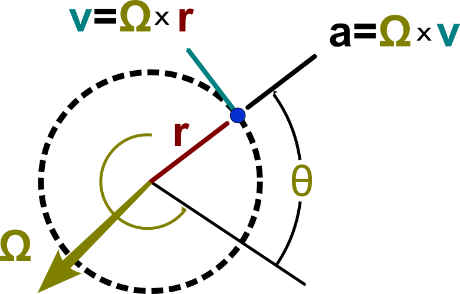

# Estimating Centripetal Acceleration
An Extended Kalman Filter to estimate centripetal acceleration from GNSS and IMU readings

**Michael Nix**, Allegory Technology, Toronto, Canada, 2021

---

The first real telematics solutions for use in auto insurance came as devices that were physically attached to cars, using their own onboard sensors, or plugging into the car to get its data--primarily speed with some measure of turn angle.  This allowed for some very basic metrics that could be used to categorize driver behaviour in order to give drivers discounts on their insurance premiums.  The metrics calculated were not very good, cars with GPS didn't fare much better, and these first attempts at behaviour based insurance largely failed.

When smartphones then brought more powerful sensors and computing power into everyone's pocket (fast CPUs, GPS, and 6- or 9-axis inertial measurement units), it was thought that, finally, behaviour based insurance was possible... as long as the driver had their phone on them while driving.  The industry then began adapting state estimation techniques developed for planes, missiles, and then drones for use in analyzing driver behaviour.  

The problem with planes is that they fly far above the ground.  Cars drive along the ground, and the ground is where all the electromagnetic interference is.  That is: magnetometers won't work if there are power lines nearby (especially if you're inside a metal box); GPS won't work if there's a building in the way or you're underground; estimation techniques fail catastrophically if you hit a pot hole or you drop your phone... So the focus shifted to using raw accelerometer data if you could guarantee that the phone was physically attached to the car in a known good orientation.  With that, you could just throw AI at raw accelerometer data, and fuse it with GPS data to... identify intersections where people stop too fast.

Other than a few press releases, I haven't seen much happen with that technology.

And yes, there are successful auto insurance telematics companies, and they work with their customers to hopefully improve the profitability of their portfolios (where regulation permits it).  But there's still a lot of mystery in what's truly being measured, and then how it's used to evaluate driver behaviour; particularly when classifying drivers into risk deciles.

The real trouble with telematics for auto insurance is that GPS can really get you most of the way there.  *If* you have good signal throughout your trip, you can get the speed, heading, latitude, and longitude data; match it to a half decent map; and, you're off to the races.  This will get you some decent metrics like:

 - General trip metadata (duration, distance, basic stats),
 - Distance traveled in known high risk areas,
 - Road segments spent speeding,
 - Average acceleration in one second intervals,
 - Periods of high linear acceleration or deceleration,
 - Periods of high lateral acceleration.

And a lot of this data can be directly correlated with accident risk.  People that decelerate, on average, significantly faster than everyone else are much more prone to accidents, for instance.  Add in some basic time-series analysis to raw accelerometer or gyroscope data--or with built-in phone features--and you can even estimate when drivers are distracted by looking at their phone.  The problem with this GPS-type approach is that there is no real failsafe in times where GPS is unreliable (and accident risk is high; read: parking garages), nor is there a way to correct for its shortcomings such as long sampling period (i.e. 1 Hz).  

A long sampling period generally leads to false positives in lateral acceleration events when turning corners--missing aggressive lane changes entirely--or false negatives in linear acceleration events when not coming to a complete stop, or when accelerating from zero kilometers per hour.  Since these play a big part in measuring the risk of an individual driver's behaviour, improving the resolution of their measurements can make telematics for auto insurance truly useful.  If we can make it work on a smartphone in an app that's easy to use, then it will actually get used by drivers.  This is the holy grail of auto insurance telematics.

From here on out we will use the terms centripetal acceleration, radial acceleration, and lateral acceleration to all mean the same thing.  It is close enough.

When reading through the literature, there has been considerable effort in mapping the pose of the car of interest to a known good coordinate system such as the North-East-Down (NED) reference frame.  When using a phone to estimate the pose of the car, there have been many different ways of trying to determine the orientation of the phone relative to the car, as well as the position of the phone within the car.  Usually this means taking the phone's GPS speed and heading (relative to magnetic north pole), and somehow mapping it to its accelerometer and gyroscope readings.  Because of the use of the NED reference frame, the problem tends to be simplified by estimating 2D acceleration, speed, and a heading angle; assuming a good vector for down can be estimated and removed from the sensor readings.  These various approaches don't quite get us what we need; however, we still need to translate these estimates to estimates of centripetal acceleration as that's what all the studies on dangerous driving behaviour use in order to classify dangerous turns or lane changes.  So what we really need is a way to separate lateral and linear acceleration from smartphone sensors, while correcting for the fact that the smartphone might not be secure within the car.  To do this, we can use the following assumptions:

1. Cars and phones are different things, and behave in different ways,
2. Phones can be contained completely within a car,
3. A phone's sensor's measurements can be fused to estimate the state of the car,
4. All measured rotations are extrinsic, and short enough that they're circular,
5. Movement of the phone within the car can be treated as another defect or source of noise.

Now, because of how tires work, when a car is turning (but not slipping, sliding, or drifting), it is always traveling tangent to some curve, which we assume to be a circle.  However, the total acceleration vector does not have to be tangential to a curve, as it may contain linear acceleration (e.g. when starting from a stop; getting up to speed), as well as centripetal acceleration (turning a corner; changing a lane); the common scenario for this being coming to a stop before turning, e.g. at a stop sign or red light. By taking advantage of the physical characteristics of the car (i.e. acknowledging its tires) as well as the distinct characteristics of a mobile phone’s sensors (GPS is fundamentally different from an accelerometer), it should be possible to use basic kinematics and notions of three-dimensional angular velocity to estimate both linear and centripetal acceleration.

A simple map of this could look something like:

<p align="center"></p>

Where we want to estimate the car's 3D velocity vector, $\mathbf{v}_\mathrm{car}$, it's lateral acceleration, $\mathbf{a}_{\mathrm{lat}}$.  To do that, we'll also need to estimate the phone's raw acceleration (assuming gravity is removed), and its raw angular velocity (assuming bias is removed).  The measurements we'll have access to will be the same, but also include the speed reading from the GPS itself.  It's possible to gain some additional insight if also using the heading reading from the GPS, but that adds too much complexity for too little value if all we want to do is use centripetal acceleration estimates to do an offline classification of driver behaviour.

Because of how circles work, if we sample our measurements fast enough we can assume all extrinsic rotations are circular, so that we can use the following vector relations:

<p align="center"></p>

Where we use upper-case Omega and lower-case omega interchangeably to represent the vector of angular velocity; from here we’ll only use lower-case omega.

The key insight is that though the phone’s accelerometer data is nearly useless on its own, once we remove significant sources of bias from it, it can still be used to inform the other estimates in our filter, allowing us to estimate a velocity vector, which we can use to directly calculate lateral acceleration from gyroscope estimates.

Before using any sensor measurements, all constant acceleration or gyroscope bias is removed from data using simple filters; taking into account average group delay.  While there will be residual error in this approach, the Kalman filter should be able to compensate for some of it.

As a recursive filter, designing a Kalman filter requires a few considerations:

1. A process model that takes estimates from the previous time step, predicting what they might be in this current time step,
2. A measurement model that uses these estimate predictions to predict what the measurements might be,
3. A process noise model that captures the relative uncertainty of your process model,
4. A measurement noise model that captures the relative uncertainty of your measurements.

Because the mapping between vector and scalar values (e.g. GPS speed as a scalar value) requires a nonlinear process, we’ll have to use an Extended Kalman Filter. Using the circular relations above, we’ll need to keep track of a velocity vector estimate, using vector accelerometer readings and scalar speed readings from GPS. The relationships are then relatively simple, where we predict the velocity, angular velocity, lateral acceleration and linear acceleration of the car from previous estimates:

```math
\mathbf{v}_{\mathrm{car}} = \mathbf{v}'_{\mathrm{car}} + \Delta t \, \mathbf{a}'_{\mathrm{phone}}
```

```math
\mathbf{\omega}_{\mathrm{car}} = \mathbf{\omega}'_{\mathrm{car}}
```

```math
\mathbf{a}_{\mathrm{lat}} = \mathbf{\omega}' \times \mathbf{v}_{\mathrm{car}}
```

```math
\mathbf{a}_{\mathrm{phone}} = \mathbf{a}'_{\mathrm{phone}}
```
Where a prime indicates an estimate from a previous time step, and all other quantities are for this current time step.  We can abstract these relationships into a linear operator by concatenating all of these equations, and then finding the Jacobian such that:

```math
\begin{bmatrix} \mathbf{v}_{\mathrm{car}} \\
\mathbf{\omega}_{\mathrm{car}} \\
\mathbf{a}_{\mathrm{lat}} \\
\mathbf{a}_{\mathrm{phone}} 
\end{bmatrix} = 
\begin{bmatrix} \mathbf{I}_3 & \mathbf{0}_3 & \mathbf{0}_3 & \mathbf{I}_3 \\
\mathbf{0}_3 & \mathbf{I}_3 & \mathbf{0}_3 & \mathbf{0}_3 \\
\mathbf{W} & \mathbf{V} & \mathbf{0}_3 & \mathbf{W} \Delta \, t \\
\mathbf{0}_3 & \mathbf{0}_3 & \mathbf{0}_3 & \mathbf{I}_3 
\end{bmatrix} 
\begin{bmatrix} \mathbf{v}'_{\mathrm{car}} \\
\mathbf{\omega}'_{\mathrm{car}} \\
\mathbf{a}'_{\mathrm{lat}} \\
\mathbf{a}'_{\mathrm{phone}} 
\end{bmatrix} 
```

Where $\mathbf{I}$ is the identity matrix, $\mathbf{0}$ is a matrix of zeros, $\mathbf{W}$ is a skew-symmetric matrix representing the rate of change of the lateral acceleration with respect to vector velocity: 

$$ 
\mathbf{W} = \frac{d}{d\mathbf{v}}(\mathbf{\omega} \times \mathbf{v}) = 
\begin{bmatrix} 0 & -\omega_z & \omega_y \\
\omega_z & 0 & -\omega_x \\
-\omega_y & \omega_x & 0 
\end{bmatrix} 
 $$

And $\mathbf{V}$ is a skew-symmetric matrix representing the rate of change of lateral acceleration with respect to angular velocity:

$$ 
\mathbf{V} = \frac{d}{d\mathbf{\omega}}(\mathbf{\omega} \times \mathbf{v}) = 
\begin{bmatrix} 0 & v_z & -v_y \\
-v_z & 0 & v_x \\
v_y & -v_x & 0 
\end{bmatrix} 
$$

In the parlance of Kalman filters, we can abstract this such that our state transition matrix, $\mathbf{F}$, is simply: 

$$ 
\mathbf{F} = \begin{bmatrix} \mathbf{I}_3 & \mathbf{0}_3 & \mathbf{0}_3 & \mathbf{I}_3 \\
\mathbf{0}_3 & \mathbf{I}_3 & \mathbf{0}_3 & \mathbf{0}_3 \\
\mathbf{W} & \mathbf{V} & \mathbf{0}_3 & \mathbf{W} \Delta \, t \\
\mathbf{0}_3 & \mathbf{0}_3 & \mathbf{0}_3 & \mathbf{I}_3 \end{bmatrix} 
$$

We also need a way to map our predictions to measurements by using them to predict what the measurements might be. Since we have a scalar speed from our GPS, vector angular velocity from our gyroscope, and vector acceleration from accelerometer. This means that our measurement predictions can be:

```math
v_{\mathrm{GPS}} = (\mathbf{v}^\mathrm{T}_{\mathrm{car}}\mathbf{v}_{\mathrm{car}})^{\frac{1}{2}} \\

\mathbf{\omega}_{\mathrm{gyro}} = \mathbf{\omega}_{\mathrm{car}} \\

\mathbf{a}_{\mathrm{accel}} = \mathbf{a}_{\mathrm{phone}}
```

Where again, we combine these relationships into a vector, then find its Jacobian to linearize them so that measurement predictions can be related to estimate predictions by:

```math
\begin{bmatrix}
v_\mathrm{GPS} \\
\mathbf{\omega}_\mathrm{gyro} \\
\mathbf{a}_\mathrm{accel}
\end{bmatrix} = 
\begin{bmatrix}
|\partial\mathbf{v}| & \mathbf{0}_{1\times3} & \mathbf{0}_{1\times3} & \mathbf{0}_{1\times3} \\
\mathbf{0}_3 & \mathbf{I}_3 & \mathbf{0}_3 & \mathbf{0}_3 \\
\mathbf{0}_3 & \mathbf{0}_3 & \mathbf{0}_3 & \mathbf{I}_3
\end{bmatrix}
\begin{bmatrix}
\mathbf{v}_\mathrm{car} \\
\mathbf{\omega}_\mathrm{car} \\
\mathbf{a}_\mathrm{lat} \\
\mathbf{a}_\mathrm{phone}
\end{bmatrix}
```

Where the Jacobian of a speed scalar with respect to its underlying velocity vector is:

```math
|\partial\mathbf{v}| = \frac{d}{d\mathbf{v}}(\mathbf{v}^\mathrm{T}\mathbf{v})^\frac{1}{2}
= (\mathbf{v}^\mathrm{T}\mathbf{v})^{-\frac{1}{2}}
\begin{bmatrix}
v_x & v_y & v_z
\end{bmatrix}
```

We can then abstract this back to get our observation matrix, $\mathbf{H}$:

```math
\mathbf{H} = 
\begin{bmatrix}
|\partial\mathbf{v}| & \mathbf{0}_{1\times 3} & \mathbf{0}_{1\times 3} & \mathbf{0}_{1\times 3} \\
\mathbf{0}_3 & \mathbf{I}_3 & \mathbf{0}_3 & \mathbf{0}_3 \\
\mathbf{0}_3 & \mathbf{0}_3 & \mathbf{0}_3 & \mathbf{I}_3
\end{bmatrix}
```

Since we’re using a constant acceleration and constant angular velocity model, that makes our model uncertainty matrix:

```math
\mathbf{Q}_a = 
\begin{bmatrix}
\mathbf{0}_3 & \cdots & \cdots & \mathbf{0}_3 \\
\vdots & \sigma^2_\omega & \ddots & \vdots \\
\vdots & \ddots & \mathbf{0}_3 & \mathbf{0}_3 \\
\mathbf{0}_3 & \cdots & \mathbf{0}_3 & \sigma^2_a
\end{bmatrix}
```

Which transforms into a process uncertainty matrix, $\mathbf{Q}$:

```math
\mathbf{Q} = \mathbf{FQ}_a\mathbf{F}^\mathrm{T}
```

Finally, we assume that because our three sensors—-GPS, gyroscope, accelerometer-—are all separate devices, even though they’re combined in one smartphone, have no overlapping uncertainties in their larger covariance matrix, $\mathbf{R}$:

```math
\mathbf{R} = 
\begin{bmatrix}
\sigma^2_\mathrm{GPS} & \mathbf{0}_{1\times 3} & \mathbf{0}_{1\times 3} \\
\mathbf{0}_{3\times 1} & \sigma^2_\mathrm{gyro}\mathbf{I}_3 & \mathbf{0}_{3} \\
\mathbf{0}_{3\times 1} & \mathbf{0}_3 & \sigma^2_\mathrm{accel}\mathbf{I}_3
\end{bmatrix}
```

Where we also assume no covariance in measurement within each sensor, as both gyroscopes and accelerometers collect measurements along three orthogonal axes. Even if there is some covariance between sensors or between sensor axes, that will just eventually increase the uncertainty in estimates via covariances that will most likely be quite small.

From here, we can just use the above matrices to march step-by-step through a Kalman filter as measurements come through with the standard formulas:

```math
\mathbf{x}_p = \mathbf{Fx}' \\
\mathbf{P}_p = \mathbf{FP}'\mathbf{F}^\mathrm{T} + \mathbf{Q}
```

Where $\mathbf{x}_p$ is a prediction of the current state (in this case, our car), $\mathbf{P}_p$ a prediction of the uncertainties in that state. Combined with the observation matrix, and noise matrices:

```math
\mathbf{K} = \mathbf{P}_p\mathbf{H}^\mathrm{T}(\mathbf{HP}_p\mathbf{H}^\mathrm{T} + \mathbf{R})^{-1}
```

$\mathbf{K}$ is our Kalman gain, and:

```math
\begin{aligned}
\mathbf{x}_e &= \mathbf{x}_p + \mathbf{K}(\mathbf{z} - \mathbf{Hx}_p) \\
&= (\mathbf{I} - \mathbf{KH})\mathbf{x}_p + \mathbf{Kz} \\
\mathbf{P}_e &= (\mathbf{I-KH})\mathbf{P}_p(\mathbf{I-KH})^\mathrm{T} + \mathbf{KRK}^\mathrm{T}
\end{aligned}
```

Gives us $\mathbf{x}_e$ as our corrected estimate of the car’s state in this time step, and $\mathbf{P}_e$ the covariance matrix for its uncertainties. The only thing outstanding to make this possible is to figure out what the uncertainties / covariance for our process and measurements are. And in order to get a handle of that, we’ll have to go through a simplified analysis to better understand how various predictions and measurements are combined to create estimates.

## Simplified Analysis

In order to design process or measurement uncertainty models, we first need to understand how, based on our state and measurement prediction models fuse to inform our estimates. Since we’re effectively collecting seven measurements (GPS speed, angular velocity vector, acceleration vector), a full analysis will require us to invert a 7x7 matrix which is untenable by hand. However, if we simplify things, reducing vectors to scalars where appropriate, we’ll only need to invert a 3x3 matrix, which is relatively straightforward to do by hand.

We start with our simplified state transition model, $\mathbf{F}$:

```math
\mathbf{F} = 
\begin{bmatrix}
1 & 0 & 0 & \Delta t \\
0 & 1 & 0 & 0 \\
\alpha & \beta & 0 & \alpha\Delta t \\
0 & 0 & 0 & 1
\end{bmatrix}
```

Where $\alpha$ is an arbitrary constant that somehow turns speed estimates into lateral acceleration estimates, and $\beta$ is an arbitrary constant that somehow turns angular speed estimates into lateral acceleration estimates. We won’t need to know what $\alpha$ and $\beta$ actually are, because this simplified analysis is only used to help us design noise models. Similarly, our model uncertainty matrix is close to what we had in the vector case:

```math
\mathbf{Q}_a =
\begin{bmatrix}
0 & 0 & 0 & 0 \\
0 & \sigma^2_\omega & 0 & 0 \\
0 & 0 & 0 & 0 \\
0 & 0 & 0 & \sigma^2_a
\end{bmatrix}
```

This will have to be translated into a state transition uncertainty measurement as discussed above, though we won’t be combining it with the uncertainty in previous estimates in order to keep the analysis a little easier to manage. Now, our measurement prediction matrix is also close to what we had above:

```math
\mathbf{H} = 
\begin{bmatrix}
1 & 0 & 0 & 0 \\
0 & 1 & 0 & 0 \\
0 & 0 & 0 & 1
\end{bmatrix}
```

As is our measurement uncertainty matrix:

```math
\mathbf{R} = 
\begin{bmatrix}
\sigma^2_\mathrm{GPS} & 0 & 0 \\
0 & \sigma^2_\mathrm{gyro} & 0 \\
0 & 0 & \sigma^2_\mathrm{accel}
\end{bmatrix}
```

I’ll leave the calculation of the Kalman gain, K, to the reader, but it will be used to assemble our estimates for any given time step as:

```math
\begin{bmatrix}
v^e_\mathrm{car} \\
\omega^e_\mathrm{car} \\
a^e_\mathrm{lat} \\
a^e_\mathrm{phone}
\end{bmatrix} = (\mathbf{I-KH})
\begin{bmatrix}
v_\mathrm{car} \\
\omega_\mathrm{car} \\
a_\mathrm{lat} \\
a_\mathrm{phone}
\end{bmatrix} + \mathbf{K}
\begin{bmatrix}
v_\mathrm{GPS} \\
\omega_\mathrm{gyro} \\
a_\mathrm{accel}
\end{bmatrix}
```

If we now work through all the math properly and focus on the estimate for lateral acceleration, we get:

```math
\begin{aligned}
a^e_\mathrm{lat} = a_\mathrm{lat} &+ \frac{\alpha(\Delta t)^2\sigma^2_a\sigma^2_\mathrm{accel}}{(\Delta t)^2\sigma^2_a\sigma^2_\mathrm{accel} + \sigma^2_a\sigma^2_\mathrm{GPS} + \sigma^2_\mathrm{accel}\sigma^2_\mathrm{GPS}}(v_\mathrm{GPS} - v_\mathrm{car}) \\
&+ \frac{\beta\sigma^2_\omega}{\sigma^2_\omega + \sigma^2_\mathrm{gyro}}(\omega_\mathrm{gyro} - \omega_\mathrm{car}) \\
&- \frac{\alpha\Delta t\sigma^2_a\sigma^2_\mathrm{GPS}}{(\Delta t)^2\sigma^2_a\sigma^2_\mathrm{accel} + \sigma^2_a\sigma^2_\mathrm{GPS} + \sigma^2_\mathrm{accel}\sigma^2_\mathrm{GPS}}(a_\mathrm{accel} - a_\mathrm{phone})
\end{aligned}
```

Which shows that the estimate for lateral acceleration is primarily based on the predicted lateral acceleration (based on previous estimates of velocity and angular velocity), but then corrected using predictions and measurements for velocity, angular velocity and acceleration. Now, if we send the uncertainty of the accelerometer to infinity—also assuming very small uncertainty in GPS speed—we can see that our lateral acceleration is primarily determined by velocity and angular velocity:

```math
\begin{aligned}
\lim_{\sigma^2_\mathrm{accel} \rightarrow \infty} a^e_\mathrm{lat} = \; &a_\mathrm{lat} + \alpha(v_\mathrm{GPS} - v_\mathrm{car}) \\
&+ \frac{\beta\sigma^2_\omega}{\sigma^2_\omega + \sigma^2_\mathrm{gyro}}(\omega_\mathrm{gyro} - \omega_\mathrm{car})
\end{aligned}
```

Completely ignoring all phone accelerometer measurements and phone acceleration predictions. This implies that even in moments where our accelerometer cannot be relied upon, we still have a decent way to estimate lateral acceleration combining measurements and previous estimates. If you go simplify this some more using the process model to work backwards, you can see that this becomes:

```math
\lim_{\sigma^2_\mathrm{accel} \rightarrow \infty} a^e_\mathrm{lat} = \alpha v_\mathrm{GPS} + \beta\frac{\sigma^2_\omega\omega_\mathrm{gyro} + \sigma^2_\mathrm{gyro}\omega'}{\sigma^2_\omega + \sigma^2_\mathrm{gyro}}
```

So even if we can’t rely at all upon accelerometer data, at least we can fuse previous angular velocity estimates, current angular velocity measurements, and current speed measurements. Similarly, if we send the uncertainty of the GPS speed measurements out to infinity, we get:

```math
\begin{aligned}
\lim_{\sigma^2_\mathrm{GPS} \rightarrow \infty} a^e_\mathrm{lat} = \; &a_\mathrm{lat} + \frac{\beta\sigma^2_\omega}{\sigma^2_\omega + \sigma^2_\mathrm{gyro}}(\omega_\mathrm{gyro} - \omega_\mathrm{car}) \\
&- \frac{\alpha\Delta t\sigma^2_a}{\sigma^2_a + \sigma^2_\mathrm{accel}}(a_\mathrm{accel} - a_\mathrm{phone})
\end{aligned}
```

Showing that if GPS fails for whatever reason, we can still update our lateral acceleration estimates using angular velocity and accelerations predictions and measurements. Now that we know how lateral acceleration can be estimated when certain sensors fail, we can start thinking about noise models.

## Noise Models

In the literature they tend to say that noise models need to be constructed using, “engineering intuition,” but what this usually means is that people use static noise models based on sensor noise given by the manufacturer. However, as we know from our previous work analyzing Kalman filter variants, prediction model noise, prediction process noise, and measurement noise are just forms of uncertainty, relative in magnitude to one another, as they’re ultimately used as the weights in a weighted sum. Ergo, it’s not important to understand the noise of your model, process, or sensors in absolute terms, just in relative terms. We can then use an understanding of our operating conditions to determine when to prefer the predictions over the measurements. Also, since it’s obvious from the simplified analysis above that angular velocity measurements are always used separately from acceleration or speed measurements, we can consider their noise models separately.

First, for the model noise, since we’re assuming a constant acceleration and a constant angular velocity; and, also because we can consider these models independently, we’ll set them to be the same constant which for simplicity will be one, i.e.:

```math
\sigma^2_a = \sigma^2_\omega = 1
```

Now, because we’re trying to account for smartphones and their sensors being loose within a car in order to estimate the state of the car itself, we have to adjust the uncertainty in our measurements when there are extreme movements of the phone, but not the car (e.g. when someone picks up the phone). In order to do this, we can adjust the uncertainty in our measurements in a non-linear way, meaning that the higher a measurement is, the more uncertain it becomes, favouring the model and process over that of measurements. For gyroscope measurements, this can be a simple non-linear function such as:

```math
\sigma^2_\mathrm{gyro} = \kappa_\mathrm{gyro}(1 + \epsilon_\mathrm{gyro}\omega^2_\mathrm{gyro})
```

Where kappa is a measure of relative uncertainty when compared to your constant model, and epsilon is a parameter that determines when the non-linear effects take over to drastically increase uncertainty. Starting off, if the uncertainty in the previous state estimate is zero, and if gyroscope uncertainty is the same as model uncertainty, that means that both the process and the measurement will be used in equal measure for our centripetal acceleration estimate. If the angular velocity estimates from the gyroscope are greater than one, however, the uncertainty in those measures will increase drastically, meaning that process will be favoured significantly.

For typical angular velocity when driving a car, values much less than one radian per second are typical, usually topping out at 0.5 radians per second for a harsh 90 turn, meaning epsilon can be somewhere between one over root two or one. Also, moving cars spend most of their time going in straight lines, meaning angular velocity is typically zero, so using the process and measurement in equal measure at low angular velocities seems justified, meaning kappa can be set to one. However, when someone picks up a phone while driving, the gyroscope is capable of reading angular velocity measurements well above 10 radians per second. Since these extreme measurements are not measurements of the state of the car, increasing their uncertainty quadratically is easily justified.

We can use similar logic when discussing the uncertainty in speed measurements, but from the opposite perspective, that is:

```math
\sigma^2_\mathrm{GPS} = \kappa_\mathrm{GPS} \left (1 + \frac{9}{1 + \epsilon_\mathrm{GPS}v^2_\mathrm{GPS}}\right )
```

Where kappa and epsilon are similar to what we have for angular velocity, but this time our goal is to reduce the uncertainty in GPS speed measurements as speed increases. Since GPS speed measurements are based on the doppler shift coming from five different GPS satellites, these measurements are actually incredibly accurate (especially compared to differentiating speed from, e.g. OBD2 readings), so kappa for GPS speed can be quite low. This is doubly true when you consider our speed process is informed by a constant acceleration model which can become completely divorced from acceleration within the time between slow GPS measurements. Also, low speeds tend to occur in areas where GPS is naturally less accurate, i.e. not on highways characterized by wide open spaces. For our application, we can get good results if we say that the GPS speed measurement is 10 times less unpredictable than the speed process, meaning that kappa is 0.1 m2/s2; we also get good results if epsilon is simply set to one s2/m2 since we want the quantity within the brackets to be unitless.

Now, similar to angular velocity, we have for the uncertainty in the accelerometer readings:

```math
\sigma^2_\mathrm{accel} = \kappa_\mathrm{accel}(1 + \epsilon_\mathrm{accel}a^2_\mathrm{accel})
```

Where kappa and epsilon are very similar to what we have for angular velocity. Also similar to angular velocity, accelerometer readings are typically close to zero as the acceleration and deceleration of a car only happen near intersections, though with smaller fluctuations for lane changes and adjusting to traffic conditions. Also, accelerometer readings while the sensors are placed in a car that’s driving are not stationary. That is, the properties of the noise (its variance) change depending on the speed of the car. Higher speeds correlate to higher noise, which makes intuitive sense since sensor noise comes in the form as bumps in the road whose severity depends on how fast you’re going. It also depends on how fast things are rotating within the car, i.e. RPMs. However, since extreme acceleration events for a car that is driving happen at a threshold of 2.4 m/s2, anything above, say, 3 m/s2, can be safely ignored. This means that acceleration readings due to someone dropping the phone or picking it up, which can reach up to 20 m/s2, are relatively easy to spot and filter out by increasing the uncertainty quadratically.

Now, because we’re using 3D acceleration, velocity and angular velocity vectors, but can only use scalar speed measurements to correct for velocity, we have to make sure that the acceleration at the very least accurately gets the velocity vector point in the right direction when accelerating from rest. After that, we can keep the velocity vector clamped in place using scalar speed measurements from the GPS. Then, since angular velocity measurements are relatively decent (except when someone picks up the phone), we know that we can get decent centripetal acceleration estimates. To this end, we want to keep the uncertainty in acceleration low relative to speed measurements at low speeds (e.g. as we have above), but want to make sure that the more accurate speed measurements are much less uncertain as speed increases.

However, since speed measurements come in less frequently than acceleration measurements, if you want usable acceleration estimates, you have to make sure that at low speeds, acceleration and speed measurements are more or less equally uncertain, with only speed becomes less uncertain as speed increases. If speed is significantly more uncertain than acceleration, then the acceleration estimates will be more or less useless; however, the measurements can still be useful to help inform accurate velocity estimates. Again, since GPS measurements are by far the most accurate, if you favour them above all else, then you’ll find that the magnitude of your velocity vector will end up matching your GPS measurements very closely.

This means that if you want useful acceleration measurements, then you can set the accelerometer kappa to be equal to the GPS kappa, but if you don’t care about acceleration measurements, then you can set the accelerometer kappa to be one hundred times greater.

## Implementation Considerations

Theoretically it’s possible to control how often you receive data from smartphone sensors, e.g. ten times a second; however, in practice that’s rarely true. Furthermore, different sensors have different upper limits to how fast they can send readings to the operating system of your mobile phone. For example, while some smartphone accelerometers can send accelerometer readings to the operating system one hundred times a second, GPS is strictly limited to updating data no more than once per second. Also, because different sensors have their own clocks, with slight errors compared to one another or the system clock, it can be hard to determine exactly when a measurement is sent to the operating system.

Reading through the literature, most filtering for telematics seems to assume that measurements all come in at the same time, so that every time you update your state estimates, you don’t have to think about the above complications. However, since this isn’t the case in real life, we investigated a few possible ways to address things:

1. Fixed Rate Filtering: filtering at regular time intervals using the most recent measurements,
2. Loose Filtering: accumulating high frequency measurements while waiting for your slowest measurement to arrive,
3. Sequential Filtering: updating your state estimate every time a measurement arrives.

None of these are really discussed in the literature, though fixed rate (with simultaneous measurements) seems to be the approach that’s typically assumed. I have come across loose and sequential filtering in the wild via open-source implementations that are public on GitHub, but I don’t really consider sequential filtering to be sensor fusion, as it really just implements a separate filter for each measurement, meaning it’s just a least squares estimator.

Before we discuss each in kind, please note that there are no hard rules on any of this, feel free to mix and match based on your requirements. Personally, loose filtering at a fixed rate makes a lot of sense, but when using slow GPS measurements with strict data transfer constraints, loose filtering with a GPS measurement triggering a state update, is the way to go.

### Fixed Rate Filtering

Fixed rate filtering is probably the default way that people think about using sensor data. That is, once every so often, at a fixed interval, data from multiple sensors arrives all at the same time, and can more or less be processed instantly (or near enough). Complications arise, however, when you realize that this is not quite so. For most smartphones, it’s not about polling sensors for their current reading, it’s about registering events with the operating system, to be fired at a specified rate, or after a certain amount of time has passed. It gets complicated, because these things aren’t exact, and when you have more than one sensor, they generally do not align in time. Moreover, depending on the system you’re working with (phone, OS, sensors, etc.), you might not have any control over sensor event / interrupt rates, so you have to work with what you get.

How then, can we simulate fixed rate filtering in real-life?

Simple: maintain a series of relatively up-to-date readings that can be used at a fixed rate. That is, every time a sensor event occurs, you update whatever variable you’re using to keep track of that sensor value. If you get events from the sensors fast enough, and filter at a rate slightly slower than that, that’s almost as good as if all of your sensor events were to arrive at the same time.

Pseudocode for this approach could look something like this:

 - New Sensor Event:
   - update time between events using the system clock

 - Accelerometer:
   - low-pass and/or gravity filter accelerometer measurements
   - discard old acceleration measurement
   - update acceleration measurement

 - Gyroscope:
   - bias filter angular velocity measurement
   - discard old angular velocity measurement
   - update angular velocity measurement

 - GPS:
   - discard old speed measurement
   - update speed measurement

 - Timer:
   - new state estimate = kalman_filter (old state, measurements)

For the most part, this type of approach is what I’ve used, but when using slow sensors like GPS, errors can accumulate in between measurements (assuming you’re filtering faster than GPS readings come in) such that it might be worthwhile looking into other ways to go about things.

### Loose Filtering

Loose filtering is something I stumbled upon when auditing open-source projects, and it might help fit filtering implementations into a stricter set of constraints. The gist of it is that if you are filtering at a slow fixed rate, or at the rate of your slowest sensor (e.g. GPS), you might lose critical information if you just discard measurements that come in from faster sensors. So, in between filter events you accumulate and average values from your faster sensors, using the result when you do eventually get around to filtering. This also allows you to perform some real-time filtering on the data that otherwise would not be possible at a lower rate.

For example, if you’re measuring speed 25 times a second, but distance only once a second and then filtering only once a second, you would accumulate the 25 speed measurements, averaging them out over the course of a second, and then say, “that’s the total speed measurement for the previous second,” that you can then hand off to your filter.

This is useful if you need real sensor data for post-processing, but can’t afford to transmit sensor data 25 times a second. You can still get useful information from your sensors at a slow rate, and still get decent state estimates from your filters, but you won’t use up as much space or need to transfer as much data.

Pseudocode for this approach could look like:

 - New Sensor Event:
   - update time between events using the system clock

 - Accelerometer:
   - low-pass and/or gravity filter accelerometer measurements
   - accumulate acceleration measurements

 - Gyroscope:
   - bias filter angular velocity measurement
   - accumulate angular velocity measurements

 - GPS:
   - update speed measurement
   - new state estimate = kalman_filter (old state, measurements)
   - reset accumulators

This is a great approach and you can get good estimates while operating with other data / storage constraints, though it will ultimately result in lower resolution estimates. Also, if your filter rate is too slow, your averages can come to something completely wacky, like zero, when in reality your state has done something interesting like turn around.

### Sequential Filtering
Don’t use sequential filtering. I also came across this while auditing open-source projects, primarily in the autonomous vehicle space. Basically, you don’t do sensor fusion: you just use a Kalman filter as a least squares filter to kinda smooth out your data as it comes in. That is, for every discrete sensor event, you build a separate filter that only takes that event as input, estimating the same thing. I don’t get it, but I see it all over the place.

Pseudocode is very boring:

 - New Sensor Event:
   - update time between events using the system clock

 - Accelerometer:
   - low-pass and/or gravity filter accelerometer measurements
   - update acceleration measurement
   - new state estimate = kalman_filter_ACCEL (old state, acceleration measurement)

 - Gyroscope:
   - bias filter angular velocity measurement
   - update angular velocity measurement
   - new state estimate = kalman_filter_GYRO (old state, gyroscope measurement)

 - GPS:
   - update speed measurement
   - new state estimate = kalman_filter_GPS (old state, speed measurement)

## Example

While I can't give a full implementation of this filter, I can share one small snippet of some initial results from an unrefined beta test:

<p align="center"></p>